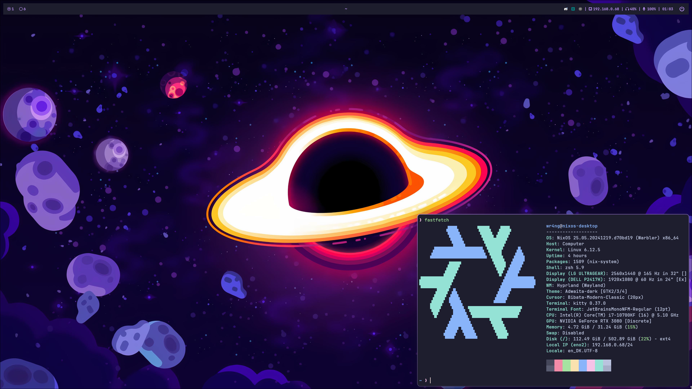

# My NixOS config


# Commands
I place my configuration (this repo) at `~/nixos`.

Rebuild desktop:
```shell
sudo nixos-rebuild switch --flake ~/nixos#desktop
```

Rebuild laptop:
```shell
sudo nixos-rebuild switch --flake ~/nixos#yoga
```

# TODO
- [ ] See hardware config for laptop: https://github.com/NixOS/nixos-hardware
- [ ] Cleanup `desktop`'s `configuration.nix` and `home.nix`
- [ ] Setup cleanup of storage + nix-store (https://nixos.wiki/wiki/Cleaning_the_nix_store, https://nixos.wiki/wiki/Storage_optimization)
